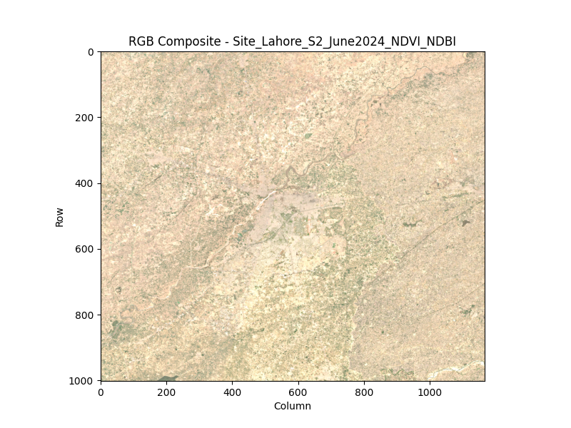
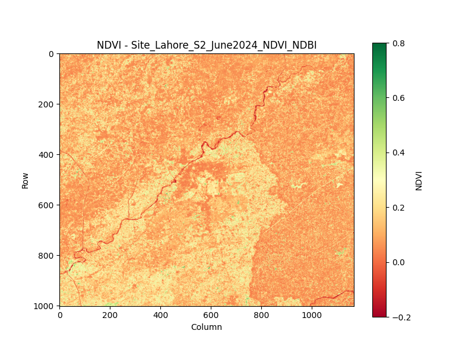
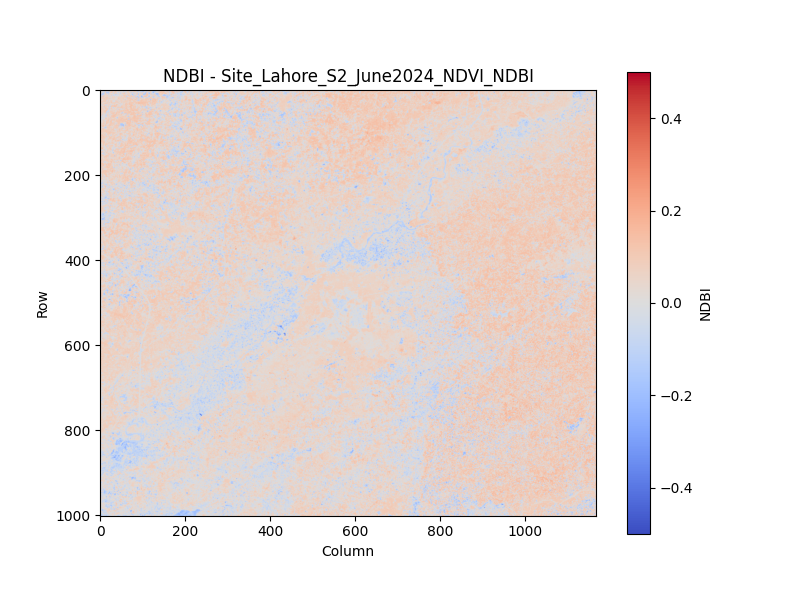
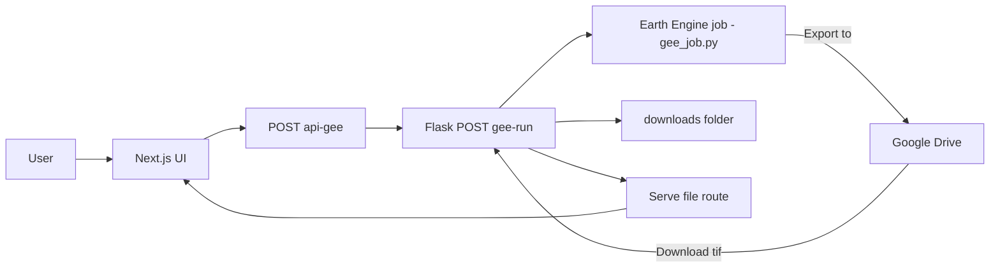

## Pakistan Satellite Crop Imagery Portal

Beautiful, fast, and practical satellite imagery for Pakistan’s cities and agricultural regions. Enter a location (e.g., "Lahore, Pakistan") to fetch the most recent cloud‑free Sentinel‑2 mosaic and instantly visualize RGB, NDVI, and NDBI layers, with a one‑click download of the full GeoTIFF.

---

### Highlights
- <b>Sentinel‑2</b>: Recent, low‑cloud imagery composited via Google Earth Engine
- <b>Indices</b>: NDVI (vegetation) and NDBI (built‑up areas) alongside RGB
- <b>Download</b>: Full multi‑band GeoTIFF export available
- <b>Modern UI</b>: Next.js 15, TailwindCSS, dark theme, fullscreen layer viewer

---

### Quick preview

<p align="center">
  
  
  
</p>

---

### Table of contents
- Overview and flow
- Features
- Architecture
- Key files and directories
- Getting started
- API contract
- Troubleshooting and notes

---

### Overview and flow
1) User enters a city or place name in the web UI
2) UI calls a Next.js API route, which proxies to a local Flask service
3) Flask launches an Earth Engine export job to Google Drive
4) Flask downloads the GeoTIFF, generates RGB/NDVI/NDBI PNGs, and responds with a manifest
5) The UI displays the imagery layers and provides a GeoTIFF download link



---

### Features
- <b>Location search</b>: Type any city/place in Pakistan; results are cached locally per session
- <b>Layer viewer</b>: Toggle RGB, NDVI, NDBI; click to open a fullscreen view and cycle layers
- <b>Recent history</b>: The last 5 queries are stored in localStorage for quick reuse
- <b>Direct download</b>: Get the original multi‑band GeoTIFF exported from Earth Engine
- <b>Extensible</b>: Included (not yet wired) Leaflet map picker and canvas‑based pixel inspector

---

### Architecture
- <b>Frontend</b>: Next.js 15, React 18, TailwindCSS, Lucide icons
- <b>API proxy</b>: Next.js route forwards requests to the Flask backend
- <b>Backend</b>: Flask service that executes an Earth Engine export helper
- <b>Processing</b>:
  - Geocode place → build ROI → filter S2 by date & cloud → compute NDVI/NDBI
  - Export to Google Drive → download GeoTIFF → create RGB/NDVI/NDBI PNGs
  - Serve files and return a manifest JSON

---

### Key files and directories
- `app/page.tsx`: Main page; location input, fetch logic, caching, layer selection, fullscreen viewer, GeoTIFF download
- `app/api/gee/route.ts`: Next.js API route that proxies `{ location }` to Flask and returns the manifest
- `backend/gee_script.py`: Flask app with `POST /gee/run` to trigger the EE job and `GET /gee/file/<name>` to serve outputs
- `backend/gee_job.py`: Earth Engine export job; geocodes input, builds ROI, exports, downloads GeoTIFF, renders layer PNGs, writes manifest
- `public/images/…`: Example imagery assets used in this README and the site
- `components/…`:
  - `hero-slider.tsx`, `feature-section.tsx`, `stats-section.tsx`, `about-section.tsx`, `footer.tsx`: UI sections
  - `interactive-satellite-viewer.tsx`: Canvas‑based inspector (pixel value readouts); currently not wired into the main page
  - `MapSelector.tsx`: React‑Leaflet coordinate picker; also not wired into the main flow yet

---

### Getting started

Prerequisites
- Node.js 18+
- Python 3.10+
- A Google Cloud service account with Google Earth Engine and Google Drive APIs enabled, and the service account JSON key file on disk

1) Install frontend dependencies

```bash
pnpm install
# or
npm install
```

2) Start the Flask backend (in a new terminal)

Install required Python packages (example):

```bash
python -m venv .venv && source .venv/bin/activate
pip install flask google-api-python-client google-auth google-auth-oauthlib google-auth-httplib2 geopy earthengine-api rasterio pillow numpy matplotlib
```

Ensure your Earth Engine and Drive service account key exists and update `EE_KEY_PATH` in `backend/gee_job.py` to point to it. Then run:

```bash
python backend/gee_script.py
# Flask will listen on 127.0.0.1:8001
```

3) Start the Next.js app

```bash
pnpm dev
# or
npm run dev
# Next.js will listen on 127.0.0.1:3000 by default
```

4) Use the app
- Open `http://localhost:3000`
- Enter a place, e.g., "Lahore, Pakistan"
- Wait for the export (Earth Engine may take a few minutes)
- Explore RGB/NDVI/NDBI layers, open fullscreen, and download the GeoTIFF

---

### API contract

Request
```http
POST /api/gee
Content-Type: application/json

{"location": "Lahore, Pakistan"}
```

Response (success)
```json
{
  "location": "Lahore, Pakistan",
  "date": "2024-06-12",
  "png": {
    "rgb": "/gee/file/Site_Export_1746224689_RGB.png",
    "ndvi": "/gee/file/Site_Export_1746224689_NDVI.png",
    "ndbi": "/gee/file/Site_Export_1746224689_NDBI.png"
  },
  "tif_url": "/gee/file/Site_Export_1746224689.tif"
}
```

Response (error)
```json
{
  "error": "Flask service failed",
  "detail": "…raw Flask logs…"
}
```

---

### Troubleshooting and notes
- <b>Earth Engine credentials</b>: Set `EE_KEY_PATH` in `backend/gee_job.py` to your service account key path. Enable both Earth Engine and Drive APIs for the service account
- <b>Export time</b>: Exports can take minutes. The API waits for completion by design
- <b>Downloads folder</b>: Flask serves files from `backend/downloads/`
- <b>Hero images</b>: The hero slider references `public/images/pakistan-forest-*.jpg`. Add your own images or update the paths
- <b>Extensibility</b>: Consider wiring `MapSelector.tsx` and `interactive-satellite-viewer.tsx` into the main page for map‑based selection and pixel inspection

---

### License
This project is provided as‑is for demonstration and research purposes. Add your preferred license here.
